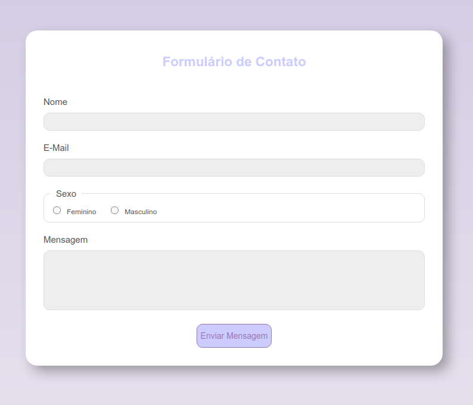
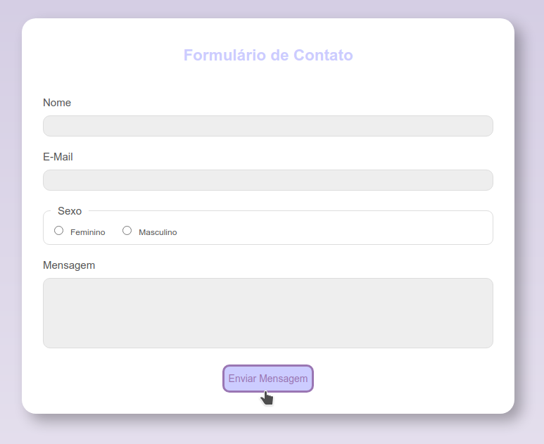
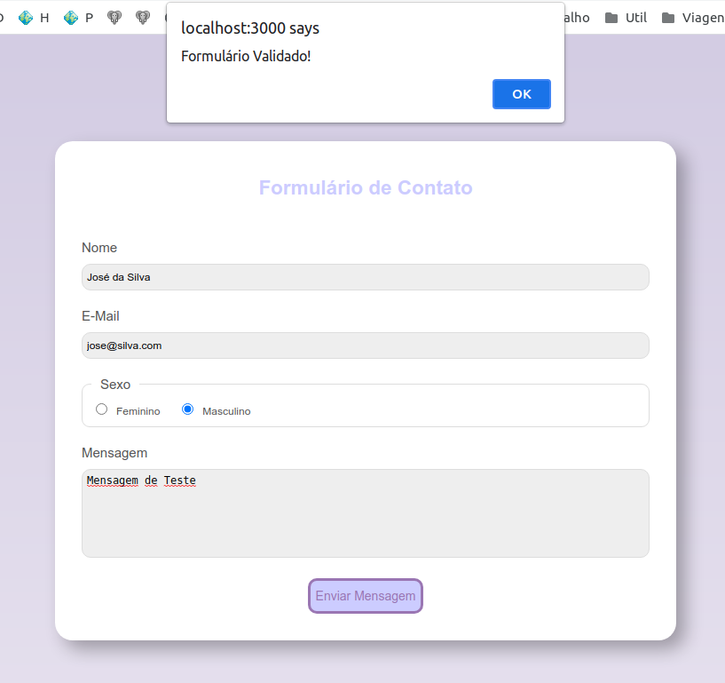

# Exercício acerca da API styled-components

Esse exercício deve considerar o clone do código público disponibilizado no repositório [alexpaulooliveira/reactjs_exerc__styled_components___start_point](https://github.com/alexpaulooliveira/reactjs_exerc__styled_components___start_point) como ponto de partida.

### Como baixar, configurar, e executar a aplicação:

Estando na pasta à partir da qual você deseja que a aplicação seja criada, execute o seguinte comando:

```
git clone <endereço do repositório>
```

Depois, instale as bibliotecas listadas no package.json, fazendo uso do seguinte comando:

```
npm install
```

Por fim, execute a aplicação fazendo uso do seguinte comando:


```
npm start
```

## Objetivos do exercício:


### 1) Ajuste de look and feel:

O formulário deve ficar com a aparência idêntica à que pode ser vista na imagem abaixo:



Isso implica:\
a) Formulário com bordas arredondadas;\
b) Inputs com bordas arredondadas;\
c) Botão com bordas arredondadas;\
d) Fundo dos inputs acinzentados;\
e) O título e o botão devem ter cores próximas do *background*;


### 2) Realce de foco:

O formulário deve realçar a seleção do componente que possuir o foco com uma cor aproximadamente igual à do *background*.


### 3) Botão sensível ao *on hover*

Tanto o botão, quanto o cursor do mouse, devem mudar o estilo quando o usuário passar o mouse sobre o botão. Observe a imagem abaixo:



### 4) Validação dos campos

Todos os campos devem ser considerados requeridos. Na submissão do formulário, uma mensagem de erro deve ser exibida, caso algum campo não tenha sido preenchido, conforme imagem abaixo:


### 5) Mensagem informando que o formulário esta validado:

Quando o formulário for submetido, se todos os campos estiverem corretamente preenchidos, uma mensagem indicando isso deve ser exibida, conforme *print screen* visto abaixo:



**OBS: O aluno pode atingir resultados melhores! As solicitações acima representam apenas um ponto de partida!**

